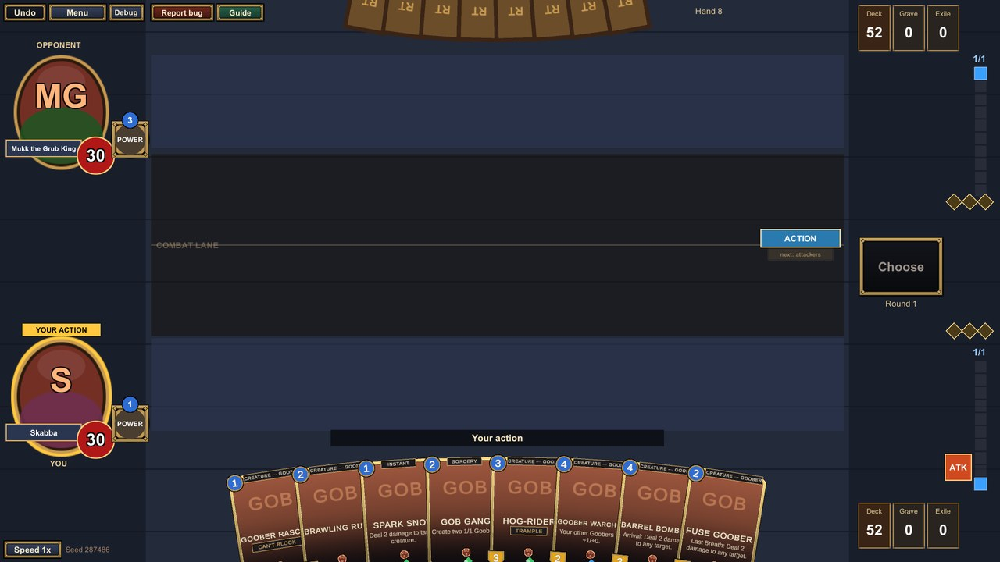
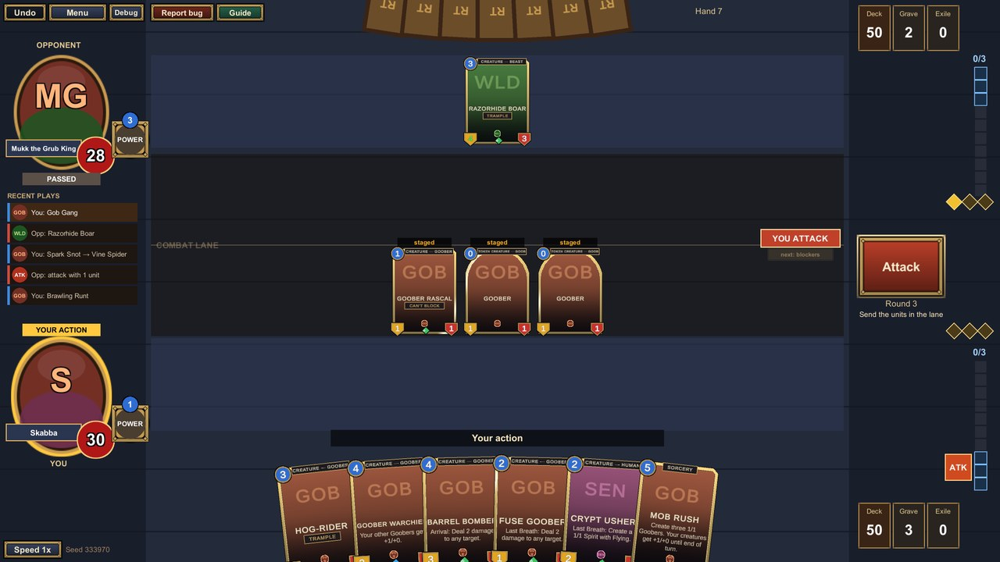
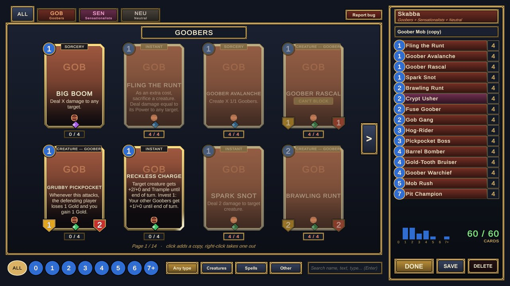

# Restarted Tavern

A 1v1 trading card game for Windows. MTG is the rules backbone, with **Legends of Runeterra rounds** (players alternate
single actions, the attack token passes every round), **permanent damage** (creatures keep their wounds) and **Gold**
(unspent mana is banked to pay for spells and abilities later). Five factions, each deck led by a **Tavern Dweller**.

## Where the game is now: v1.0

**v1.0 is the first release, made for a few friends to play and break.** The rules are frozen: future releases add
cards, keywords, mechanics and formats, never rule changes ([Game Design §0](docs/GAME_DESIGN.md)).

What's playable:

- **216 cards** and **10 Tavern Dwellers** across **5 factions**, with **6 prototype decks**
- **Against the bot**, or **hot-seat** with a friend on one screen
- A scripted 3-round **tutorial** (about 5 minutes)
- The **Tavern Guide** (F3): about 60 searchable rules pages with screenshots, slideshows and live example cards
- A **deck editor** for your own decks
- **Sound**: smooth, LoR-style synthesized effects, each faction its own instrument; volume and a Sound board in Settings
- **Report bug** on every screen (F2): a screenshot plus the full game state, which replays exactly

## Play

- **Download** the latest zip from [Releases](https://github.com/Birtkak/Restarted-Tavern/releases), unzip, run
  `RestartedTavern.exe` (Windows). SmartScreen may warn about an unsigned app: More info → Run anyway.
- Start with **Tutorial**, then **Play** against the bot or a friend. Rules questions: the in-game **Tavern Guide** (F3).
- Controls: drag cards from your hand to play them; drag creatures into the middle lane to attack, onto attackers to
  block. **Space** = the big button, **Esc** = cancel / Settings, **Ctrl+Z** = undo, **F2** = report a bug.
- Found a bug, or a deck that feels too strong? **Report bug** (F2) saves a folder in `BugReports/` next to the game;
  zip it and send it over (Discord, email or a GitHub issue).

## Inspirations: what came from where

**Magic: The Gathering**, the rules backbone. Anything the rules don't cover follows the MTG Comprehensive Rules.
Zones, the stack (our **Chain**) and priority, blocking, Trample / Flying / Lifelink / Vigilance, Equipment and Auras
(our **Curses**), the Legendary rule, the London mulligan, 60-card decks with 4 copies.

**Legends of Runeterra**: rounds where everyone acts, alternating single actions, the attack token passing every
round, no summoning sickness, spell mana (our **Gold**, capped at 3), the one context button, the combat lane, the card
look and the presentation (beats, banners), and the sound events.

**Hearthstone**: mana that grows by itself every round (no lands), the tavern setting, the deck editor's collection
layout, and the hero-like face (our **Tavern Dweller**).

**MTG Arena**: the fanned hand, the board layout, tapped cards turning, tucked Equipment, the targeting arrow.

## What's unique

- **Permanent damage.** Creatures keep their wounds between rounds, so healing is a real resource. Losing a buff can't
  kill a creature.
- **Gold.** Unspent mana is banked (up to 3) for spells and abilities, and is spent first. **Invest** costs are paid
  only with Gold.
- **Tavern Dwellers.** Your face in the game: a passive and a Power, and each unlocks a fixed pair of the 5 factions.
- **Five factions**: the shady deals of the **Shadow Money Wizards**, the **Goobers**, the **Sensationalists**, the
  **Evergrowing Wild** and **Glitterworld**.
- **One trigger per source.** Repeated triggers merge into one (×N) instead of flooding the Chain.

## Roadmap

1. Friends playtest; balance from bug reports and feedback (balance is fixed with cards, never with rules)
2. Card art and music
3. New cards and sets, keywords and Tavern Dwellers (additions only)
4. A stronger bot
5. Multiplayer (3–4 players) and a singleton format
6. Online play

## Build from source

Unity **6000.6.4f1**. Open the project, then **Restarted Tavern → Build Windows** (writes `Builds/Table/`), or open
`Assets/Scenes/Table.unity` and press Play. Tests, tools and commands: [Development](docs/DEVELOPMENT.md).

## Docs

- [Handover](docs/HANDOVER.md): the state of v1.0, how to ship it, how to grow the game
- [Game Design](docs/GAME_DESIGN.md): the rules (v1.0, frozen) and the Decision Log
- [Card Design Guide](docs/CARD_DESIGN.md) · card lists: [Shadow Money Wizards](docs/cards/shadow_money_wizards.md) · [Goobers](docs/cards/goobers.md) · [Sensationalists](docs/cards/sensationalists.md) · [Evergrowing Wild](docs/cards/evergrowing_wild.md) · [Glitterworld](docs/cards/glitterworld.md) · [Neutral](docs/cards/neutral.md) · [Tavern Dwellers](docs/cards/tavern_dwellers.md)
- [Client Design](docs/CLIENT_DESIGN.md) · [Development](docs/DEVELOPMENT.md) · [Playtesting](docs/playtest/PLAYTEST.md) · [Release notes](docs/RELEASE_NOTES.md)
